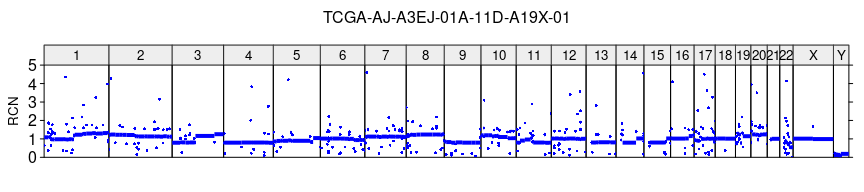
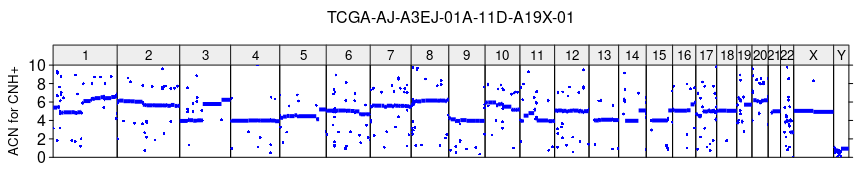

<!-- README.md is generated from README.Rmd. Please edit that file -->
<!-- badges: start -->

[](https://github.com/grendar/CNHplus/actions/workflows/R-CMD-check.yaml)
<!-- badges: end -->

## Overview

CNHplus is an R library for computing the Copy Number Heterogeneity
(CNH) which respects biological constraints.

## Installation

``` r
# install.packages("devtools")
devtools::install_github("grendar/CNHplus")
```

## Usage

``` r
library(CNHplus)
data(sample_data)
#
sa = sample_data
sample_name = sa$Sample[1] # TCGA-AJ-A3EJ-01A-11D-A19X-01 from TCGA-UCEC
r = 2^sa$Segment_Mean
w = sa$End - sa$Start 
#
# plot of Relative Copy Number profile of the sample
plot_profile(sa, r, paste0(sample_name, '_RCN.tiff'),
             ylim = c(0,5), ylab = 'RCN')
```



``` r
#
# making grid
grid = make_grid(purity = seq(0.2, 1, 0.01), ploidy = seq(1.5, 5, 0.01))
#
# finding CNHplus by searching over the grid
cnh = find_cnhplus(grid, r = r, w = w, k = 1, plus = T)
#
# computing the Absolute Copy Number profile of tumor recovered by CNH+
acn_cnh = r2q(r, cnh$purity[1], cnh$ploidy[1])
#
# ploting the ACN profile recovered by CNH+
plot_profile(sa, acn_cnh, paste0(sample_name, '_ACN_for_CNH.tiff'),
             ylim = c(0,10), ylab = 'ACN for CNH+')
```



## More

Additional examples illustrating how to

-   compute CNH+ for TCGA studies
-   use CNH+ to stratify TCGA cancer patients for survival

can be found in the vignette.
